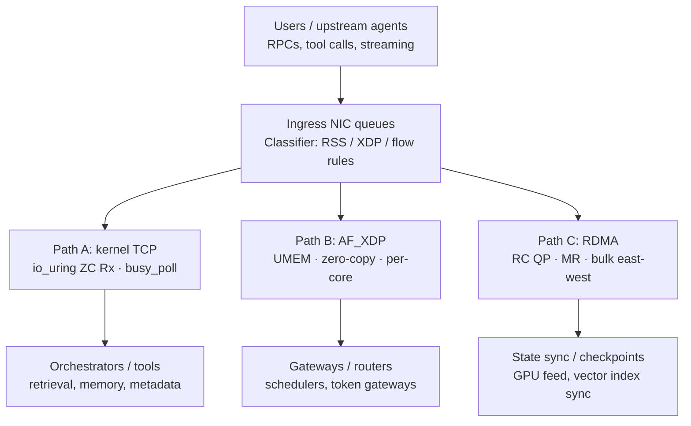

# Agentic NIC Dataplane Lab

`Agentic-NIC-Dataplane-Lab` is a Linux-first reference repo for designing, building, and benchmarking a split NIC dataplane for agentic AI systems, with an explicit path toward `bounded autonomous NIC behavior`.

The repo is opinionated about one thing: agentic AI is not only a model problem. It is a queueing, copy-avoidance, packet-steering, east-west transport, and local-control problem. The goal here is to make those tradeoffs concrete with architecture notes, Linux tuning guidance, compatibility tables, starter code, and a stronger systems model for how an autonomous NIC dataplane could operate safely.

## Five-Minute Local Demo

The repo now includes a small `v0.2` local workflow so a new reader can compile the lab, run one real localhost baseline, run one honest `AF_XDP` mock path, and generate charts from the resulting JSON.

```bash
make all
make demo
python3 tools/plot_baseline.py results/latest.json
```

What this demo is and is not:

- `Path A kernel UDP` is a real localhost kernel networking measurement using a simple echo server and client.
- `Path B AF_XDP mock` is a workflow-validation path that simulates a starter `AF_XDP` processing loop shape and output format.
- The local demo exists to validate build, run, JSON, and plotting workflow without special hardware.
- Real `AF_XDP` still requires supported NIC, driver, queue, and privilege setup. The mock path does not claim real zero-copy dataplane performance.

### Current Demo Status

| Path | Status | Requires root | Requires special NIC |
| --- | --- | --- | --- |
| Path A kernel UDP | runnable locally | no | no |
| Path B AF_XDP mock | runnable locally | no | no |
| Path B real AF_XDP | scaffold/in progress | yes | yes |
| Path C RDMA | scaffold/in progress | likely | yes |

## Repo Description

This project explores a `tri-path` host networking model for agentic AI clusters:

- `Path A`: kernel TCP for the majority of agent RPC, improved with `busy_poll`, queue affinity, and `io_uring` zero-copy receive where supported
- `Path B`: `XDP` + `AF_XDP` for selected hot queues that need lower packet overhead and stronger queue-to-core control
- `Path C`: `RDMA` for bulk east-west movement such as state sync, checkpoint transfer, shard-to-shard movement, and GPU-adjacent feeds

It also starts to define a `layered agentic NIC architecture`:

- an `Intent Layer` where the host expresses goals rather than register-level tweaks
- a bounded `Agent Layer` that proposes local dataplane adjustments
- a deterministic `Guardian Layer` that enforces safety and connectivity invariants
- an `Audit Layer` with hardware-isolated reasoning logs for dataplane mutations
- a `Tenant Quota Model` so local optimization does not destroy fairness

The intended audience is:

- systems engineers building agent infrastructure
- Linux kernel and NIC performance engineers
- inference platform teams comparing sockets vs `AF_XDP` vs `RDMA`
- researchers who want a reproducible testbed instead of architecture slides

## Key Topics

- agentic AI networking architecture
- Linux NIC queueing and IRQ affinity
- `AF_XDP`, UMEM, and queue ownership
- `io_uring` receive paths and zero-copy Rx
- `RDMA`, queue pairs, memory registration, and bulk transport
- Intel `ice` / `irdma` and Broadcom `bnxt_en` / `bnxt_re`
- benchmark design for agent-shaped workloads
- bounded autonomous NIC control
- deterministic guardrails and fail-safe policy
- hardware-isolated reasoning logs
- multi-tenant agent quotas and fairness

## Architecture

The repo now embeds the architecture diagram directly in the README so it renders on GitHub, and the source Mermaid file is still kept in [`./diagrams/tri-path-agentic-dataplane.mmd`](./diagrams/tri-path-agentic-dataplane.mmd).



## Why This Exists

Agentic AI is a coordination workload:

- many small RPCs
- retrieval and metadata fetches
- tool execution
- policy checks
- fan-out and fan-in
- streaming and retries

That shifts bottlenecks toward:

- CPU time spent in the networking and storage path
- queue placement and RSS policy
- copy overhead between kernel, userspace, and devices
- memory registration and pinned-page cost
- east-west service traffic

## Current Status

This repo is intentionally in `early-lab` form:

- the build system is now present and compile-oriented
- the benchmark harness accepts real arguments and emits JSON metadata
- the code under `src/` is still starter code, not production dataplane code
- the docs are detailed enough to orient a contributor and define the next work
- the conceptual architecture now covers not just transport choice, but how local autonomy, safety, and auditability could fit into a SmartNIC-class system

## Repo Layout

- [`./BUILDING.md`](./BUILDING.md)
- [`./ROADMAP.md`](./ROADMAP.md)
- [`./docs/networking-for-agentic-ai-blog.md`](./docs/networking-for-agentic-ai-blog.md)
- [`./docs/reference-architecture.md`](./docs/reference-architecture.md)
- [`./docs/agentic-nic-architecture.md`](./docs/agentic-nic-architecture.md)
- [`./docs/safety-and-guardrails.md`](./docs/safety-and-guardrails.md)
- [`./docs/reasoning-log-design.md`](./docs/reasoning-log-design.md)
- [`./docs/audit-layer-threat-model.md`](./docs/audit-layer-threat-model.md)
- [`./docs/multi-tenant-agent-quotas.md`](./docs/multi-tenant-agent-quotas.md)
- [`./docs/kernel-driver-tuning.md`](./docs/kernel-driver-tuning.md)
- [`./docs/benchmark-plan.md`](./docs/benchmark-plan.md)
- [`./docs/compatibility-matrix.md`](./docs/compatibility-matrix.md)
- [`./diagrams/tri-path-agentic-dataplane.mmd`](./diagrams/tri-path-agentic-dataplane.mmd)
- [`./src/io_uring/recv_zc.c`](./src/io_uring/recv_zc.c)
- [`./src/kernel_udp/udp_echo_server.c`](./src/kernel_udp/udp_echo_server.c)
- [`./src/kernel_udp/udp_client.c`](./src/kernel_udp/udp_client.c)
- [`./src/af_xdp/main.c`](./src/af_xdp/main.c)
- [`./src/af_xdp/xdp_pass.c`](./src/af_xdp/xdp_pass.c)
- [`./src/rdma/verbs_ping.c`](./src/rdma/verbs_ping.c)
- [`./scripts/run_local_baseline.sh`](./scripts/run_local_baseline.sh)
- [`./scripts/benchmark-matrix.sh`](./scripts/benchmark-matrix.sh)
- [`./tools/af_xdp_load.sh`](./tools/af_xdp_load.sh)
- [`./tools/bpftrace/guardian_preemption.bt`](./tools/bpftrace/guardian_preemption.bt)
- [`./tools/bpftrace/guardian_tail_latency_guard.bt`](./tools/bpftrace/guardian_tail_latency_guard.bt)
- [`./tools/plot_baseline.py`](./tools/plot_baseline.py)
- [`./tools/plot_e810_baseline.py`](./tools/plot_e810_baseline.py)
- [`./results/e810-baseline-2026-05-08.json`](./results/e810-baseline-2026-05-08.json)
- [`./results/sample-local-baseline.json`](./results/sample-local-baseline.json)

## Vendor Recommendation

If you want one practical Linux-first starting point:

- `Intel E810/E830`
- `ice` for Ethernet, queueing, and `AF_XDP`
- `irdma` for RDMA

If you are standardized on Broadcom:

- `bnxt_en` for Ethernet
- `bnxt_re` for RoCE

The repo does not assume one vendor forever. It is structured so contributors can compare stacks, kernels, firmware bundles, and feature maturity.

## Build and Run

The repo now has a root [`./Makefile`](./Makefile) and build notes in [`./BUILDING.md`](./BUILDING.md).

Common commands:

```bash
make all
make kernel_udp
make af_xdp
make io_uring
make rdma
make xdp_prog
make demo
```

`make all` now builds the runnable local `kernel_udp` demo path, builds the `AF_XDP` starter in real or mock-only mode depending on available headers and libraries, and skips optional `io_uring`, `RDMA`, or BPF object targets gracefully when the local environment does not provide those dependencies.

## Benchmark Harness

The benchmark harness is at [`./scripts/benchmark-matrix.sh`](./scripts/benchmark-matrix.sh). It now accepts path, workload, and interface arguments and emits a JSON result envelope with host, kernel, NIC counter, and softirq metadata.

Example:

```bash
./scripts/benchmark-matrix.sh --path tcp --workload a --iface eth0 --out results/tcp-a.json
```

It is still intentionally conservative: if the required generator tool is missing, it fails loudly instead of pretending a benchmark ran.

The repo also now includes an illustrative baseline artifact at [`./results/e810-baseline-2026-05-08.json`](./results/e810-baseline-2026-05-08.json) plus a plotting helper at [`./tools/plot_e810_baseline.py`](./tools/plot_e810_baseline.py) so the benchmark story is grounded in a reusable result format.

For the quick local workflow, use:

```bash
./scripts/run_local_baseline.sh
python3 tools/plot_baseline.py results/latest.json
```

That local path:

- runs a real localhost UDP echo benchmark for `Path A`
- runs an `AF_XDP` mock/scaffold benchmark for `Path B`
- writes a combined JSON file at `./results/local-baseline-YYYYMMDD-HHMMSS.json`
- refreshes `./results/latest.json`
- generates `./diagrams/local-baseline-throughput.png`
- generates `./diagrams/local-baseline-latency.png` when latency fields are present

A checked-in reference artifact is available at [`./results/sample-local-baseline.json`](./results/sample-local-baseline.json).

The next release blockers are now called out more explicitly in the docs:

- prove Path B is not worse than Path A for sub-`512 B` RPCs
- show guardian intervention does not violate tail-latency SLOs
- define exactly who can read the reasoning logs and under what trust model

## Priority Next Work

1. Expand the `AF_XDP` sample into a real UMEM-backed receive loop with fill/completion management.
2. Add an `XDP` loader and socket redirection plumbing around `xdp_pass.c`.
3. Extend the `io_uring` sample from setup-only into a complete `RECV_ZC` notification flow.
4. Flesh out the RDMA path with full `RESET -> INIT -> RTR -> RTS` state transitions and peer exchange helpers.
5. Add workload generators and result aggregation to the benchmark harness.
6. Formalize the `Intent -> Agent -> Guardian -> Dataplane -> Audit` model into a sharper design and possible patent memo.
