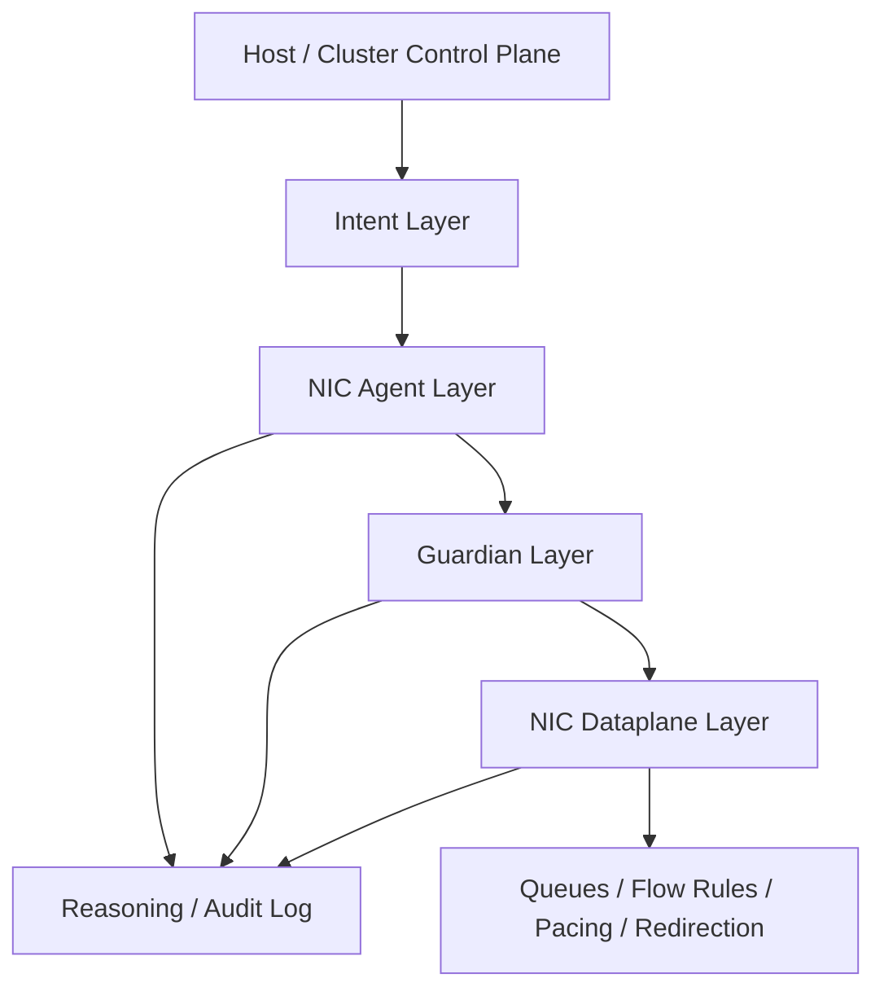

# Agentic NIC Architecture

This document extends the repo from a host dataplane benchmark lab into a stronger systems concept: a bounded, autonomous NIC control-and-data plane for agentic AI clusters.

## Core Thesis

Traditional SmartNIC designs still depend heavily on a host-side control plane:

- the host observes congestion, attacks, or queue imbalance
- the host computes a response
- the host pushes new rules or settings to the NIC

That loop is often too slow for highly dynamic agentic workloads. The architecture proposed here gives the NIC limited local agency so it can:

- observe local queue and flow state
- propose or apply safe dataplane adjustments
- log why those adjustments happened
- remain constrained by a deterministic safety shell

The goal is not unrestricted AI in the NIC. The goal is `bounded agentic optimization` at the edge of the host.

## Architectural Layers

The design is best understood as five layers:

1. `Intent Layer`
The host or cluster control plane expresses goals such as:

- prioritize inference traffic over background checkpointing
- protect latency-sensitive tool calls from queue starvation
- shed suspicious flows under attack
- keep east-west bulk transfers below a tenant budget

2. `Agent Layer`
The NIC-local agent observes counters, queue occupancy, flow classes, telemetry, and recent policy outcomes. It proposes local actions such as:

- changing queue weights
- reprioritizing traffic classes
- rerouting a flow to a different queue
- switching a service edge from a general path to a faster path

3. `Guardian Layer`
This is the non-bypassable deterministic shell. It checks proposed actions against hard safety constraints and either:

- approves them
- rewrites them into a safe form
- rejects them
- forces the NIC into a degraded fallback mode

4. `Dataplane Layer`
This is the execution surface:

- RSS and queue steering
- flow rules
- shaping and pacing
- XDP or hardware pipeline updates
- queue weight and scheduling changes
- congestion and backpressure actions

5. `Audit Layer`
This records:

- observed local state
- proposed actions
- guardian decisions
- final dataplane mutations
- timestamps, tenant scope, and confidence or reason codes

## System Sketch

## Why This Matters

This design reduces the observe-decide-act loop for selected network decisions from a host-mediated control path to a local hardware or near-hardware path. That matters when:

- queue pressure changes faster than host polling can react
- microbursts dominate tail latency
- attack or overload mitigation must happen before a host control loop can respond
- host CPU budget is already under pressure from agent orchestration

## Scope of Local Agency

The strongest version of this idea is not “let the NIC improvise.” It is:

- local autonomy over a limited action set
- explicit policy boundaries
- deterministic fallback behavior
- non-forgeable logging

That makes the architecture more believable, safer to deploy, and more defensible as an invention.
