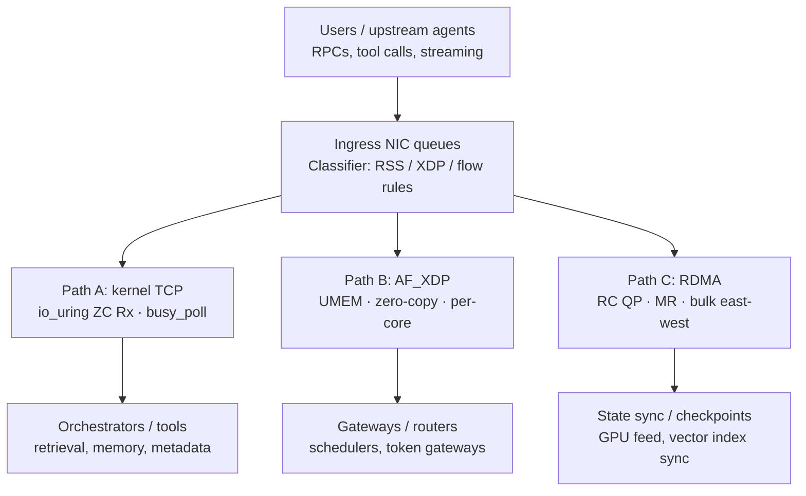

# Networking for Agentic AI: Why Your NIC Strategy Needs a Rethink

*How a tri-path Linux dataplane architecture can cut CPU overhead, reduce tail latency, and better match the real traffic shape of agent clusters*

---

The conversation about AI infrastructure almost always gravitates to two topics: GPU procurement and model serving. Those matter. But as agentic AI systems grow more complex, a quieter bottleneck is emerging. It lives in the networking stack.

Agentic systems are not just “bigger inference servers.” They are orchestration-heavy distributed systems made of planners, tool callers, retrieval services, policy checkers, schedulers, token gateways, and state-sync pipelines. Their traffic shape is different from both classic microservices and bulk inference, which means the Linux networking strategy that worked fine before can start to fail in subtle ways.

This post explains why agentic AI creates a new kind of host and NIC pressure, what the right Linux dataplane architecture looks like in response, and how [Agentic-NIC-Dataplane-Lab](https://github.com/manishklach/Agentic-NIC-Dataplane-Lab) turns those ideas into runnable code, design docs, and a benchmark framework.

---

## The workload has changed

Traditional microservice traffic is often dominated by a modest number of medium-sized RPCs. A user request fans out to a handful of services, they do work, and they return. The kernel TCP stack handles this well enough. Queue pressure is manageable. Copy overhead is usually acceptable. Per-packet CPU cost does not dominate.

Agentic AI looks different.

A single agent turn can trigger dozens of parallel downstream actions:

- planning
- tool invocation
- retrieval API calls
- policy checks
- state lookups
- verifier or evaluator traffic
- background replication and checkpointing

That produces three different traffic shapes at once:

### 1. Many small RPCs

Agent orchestration traffic is often in the `256 B` to `8 KB` range. At that scale, the fixed costs of the networking stack matter much more:

- softirq processing
- syscalls
- queue wakeups
- cache misses
- data copies

The issue is not bandwidth. It is `CPU per packet` and `tail latency per burst`.

### 2. Bursty fan-out

When an agent issues twenty or thirty tool calls at once, the burst lands on the NIC in the same moment. That can:

- spike queue depth
- create poor cache locality
- spread work across the wrong CPUs
- raise p99 latency even when average latency still looks fine

This is why queue steering and IRQ affinity matter much more than many teams expect.

### 3. Sustained east-west bulk movement

Not all agentic traffic is small. Replication, checkpoint transfer, vector index sync, and GPU-adjacent state movement create large repeated transfers between known endpoints. Those flows care less about packet latency and more about:

- throughput
- CPU cost per GB transferred
- copy avoidance
- stable completion behavior

This is where `RDMA` starts to make sense.

The common mistake is trying to solve all three traffic classes with one transport strategy.

- `RDMA everywhere` is too complex for the majority of control-style flows.
- `AF_XDP everywhere` raises operational cost for flows that benefit from normal TCP semantics.
- `kernel TCP everywhere` leaves performance on the table for the hottest and bulkiest paths.

---

## The tri-path model

The repo proposes a simple but powerful answer: a `tri-path` Linux dataplane architecture that maps different traffic classes to different network paths.

This is not “three paths for the sake of complexity.” It is three paths because the workload itself already has three shapes.

### Path A: Kernel TCP with tuning and `io_uring`

This is the default path for the majority of agent traffic:

- orchestrator RPCs
- tool calls
- memory lookups
- metadata-heavy storage requests
- ordinary service-to-service communication

The right optimization here is not bypass but `disciplined tuning`.

Important levers:

- `RSS` and explicit IRQ affinity
- `XPS` and queue-to-core alignment
- `SO_REUSEPORT` and per-core listeners
- `busy_poll` and `busy_read` for the hottest flows
- `io_uring` zero-copy receive where supported

The repo includes [`src/io_uring/recv_zc.c`](./src/io_uring/recv_zc.c), a small starter that shows the ring setup and receive-submission shape. It is still scaffold code, but it anchors the repo’s `Path A` optimization story in something concrete.

### Path B: `AF_XDP` for the hot path

`AF_XDP` lets you bypass the normal socket layer on selected NIC queues while still using the Linux driver model. That makes it a good fit for services that are extremely packet-hot and sensitive to per-packet host overhead:

- ingress routers
- retrieval front doors
- token gateways
- low-latency schedulers

The attraction is clear:

- lower per-packet CPU overhead
- stronger queue-to-core control
- optional zero-copy
- userspace ownership of the hot queue path

But it is only worth the added complexity for selected queues and services. This is why the repo treats `AF_XDP` as `Path B`, not as a universal replacement for sockets.

The repo includes:

- [`src/af_xdp/main.c`](./src/af_xdp/main.c) for the userspace bring-up skeleton
- [`src/af_xdp/xdp_pass.c`](./src/af_xdp/xdp_pass.c) for the companion XDP side

The missing UMEM-backed receive loop is still explicitly future work, which is the right level of honesty for an early lab.

### Path C: `RDMA` for bulk east-west movement

Bulk state movement wants a very different optimization target from small RPC traffic. For repeated large transfers between known endpoints, `RDMA` can reduce host CPU involvement dramatically.

Good candidates include:

- checkpoint transfer
- shard sync
- vector index propagation
- GPU-adjacent data feeds
- repeated state movement across trusted east-west fabrics

The repo’s [`src/rdma/verbs_ping.c`](./src/rdma/verbs_ping.c) walks through the key resource setup:

- protection domain
- completion queue
- reliable-connected queue pair
- memory registration

It intentionally stops before the full peer-exchange and `RESET -> INIT -> RTR -> RTS` sequence is complete, because that is one of the most valuable next contributions for the project.

---

## What “agent-shaped” benchmarking means

Most benchmark suites do not reflect real agentic traffic.

They often test:

- huge sequential streams
- tiny fixed-size packets at max PPS
- a single saturated flow

Those tests are useful, but they are not enough.

The repo’s benchmark framing is built around three workload classes:

### Class A: Agent RPC

- `256 B` to `8 KB`
- fan-out of `1` to `32`
- optional streaming
- main metrics: `p99 latency` and `CPU cost per request`

### Class B: Retrieval and memory service

- `1 KB` to `64 KB`
- mixed reads and writes
- bursty arrivals
- main metrics: `queue pressure` and `copy overhead`

### Class C: Bulk east-west state

- `64 KB` to `4 MB`
- repeated transfer patterns
- main metrics: `throughput` and `CPU per GB transferred`

The benchmark harness at [`scripts/benchmark-matrix.sh`](./scripts/benchmark-matrix.sh) accepts:

- `--path`
- `--workload`
- `--iface`
- `--out`

and emits a JSON envelope with host and NIC metadata so results are reproducible instead of anecdotal.

That metadata discipline matters. A latency number without:

- kernel version
- driver version
- queue setup
- IRQ placement
- NIC counters

is not really an infrastructure result. It is a screenshot.

---

## Why this repo matters beyond benchmarking

The project has grown into something more interesting than a transport comparison lab.

The newer architecture docs push toward a stronger systems idea: a `bounded autonomous NIC control plane`.

The repo now describes an `Intent -> Agent -> Guardian -> Dataplane -> Audit` model:

- the host expresses goals rather than low-level register tweaks
- NIC-local logic proposes bounded actions
- a deterministic guardian approves, rewrites, or rejects them
- the dataplane applies safe changes
- a reasoning log records what happened and why

That matters because the future of SmartNICs is probably not just “host pushes rules faster.” It is more likely:

- local optimization within a hard safety envelope
- tighter observe-decide-act loops for queue and flow policy
- hardware-isolated reasoning logs
- tenant-aware fairness and quotas

Those ideas are explored in:

- [`docs/agentic-nic-architecture.md`](./docs/agentic-nic-architecture.md)
- [`docs/safety-and-guardrails.md`](./docs/safety-and-guardrails.md)
- [`docs/reasoning-log-design.md`](./docs/reasoning-log-design.md)
- [`docs/multi-tenant-agent-quotas.md`](./docs/multi-tenant-agent-quotas.md)

That gives the repo a stronger research and patent trajectory, not just a performance-engineering one.

---

## Intel vs Broadcom

The repo deliberately stays pragmatic.

For teams that want one coherent Linux-first starting point across all three paths, the cleanest answer is usually:

- Intel `E810` or `E830`
- `ice` for Ethernet and `AF_XDP`
- `irdma` for RDMA

For teams already standardized on Broadcom, the practical path is:

- `bnxt_en`
- `bnxt_re`

The point is not to turn the repo into vendor marketing. The point is to give contributors a realistic baseline for where to start testing and where driver maturity matters.

The compatibility framing lives in [`docs/compatibility-matrix.md`](./docs/compatibility-matrix.md).

---

## What this lab is, and what it is not

The repo is honest about being early.

It is not yet:

- a production dataplane
- a complete UMEM-backed `AF_XDP` receiver
- a full `io_uring` ZC receive implementation
- a fully connected RDMA verbs demo

That is fine.

What it *is* today:

- a clear architecture vocabulary
- a Linux and driver tuning baseline
- a compatibility matrix
- starter build and CI scaffolding
- an agent-shaped benchmark model
- a stronger conceptual architecture for autonomous NIC behavior

That combination is valuable because it gives systems engineers a place to start from without pretending the hard parts are already solved.

---

## The broader point

Agentic AI is pushing infrastructure teams into a world previously occupied by HPC networking engineers, kernel performance specialists, and low-latency systems teams. The interesting question is no longer only “how fast is the model?” It is also:

- where are CPU cycles disappearing?
- where are copies happening?
- which traffic deserves kernel semantics?
- which traffic deserves bypass?
- which traffic deserves RDMA?
- and eventually, which decisions should happen locally at the NIC under bounded autonomous control?

That is the real motivation behind `Agentic-NIC-Dataplane-Lab`.

It is not trying to hand you a finished production stack. It is trying to give you a serious framework for thinking, measuring, and building in the right direction.

---

*Repo: [github.com/manishklach/Agentic-NIC-Dataplane-Lab](https://github.com/manishklach/Agentic-NIC-Dataplane-Lab)*
