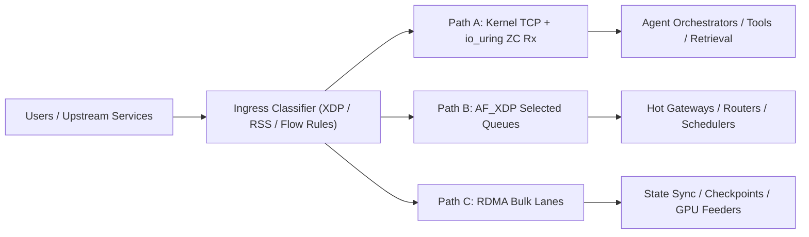

# Reference Architecture

This repo recommends a `tri-path` Linux networking architecture for agentic AI clusters.

## Design Goal

Keep the kernel where it helps, bypass it where it hurts, and reserve RDMA for the flows that can actually use it well.

## Path A: Kernel RPC

Use this for:

- planner and orchestrator RPC
- tool calls
- memory lookups
- metadata-heavy storage traffic
- general microservice communication

Recommended features:

- `RSS`, `XPS`, and explicit IRQ affinity
- `NAPI` and `busy_poll`
- `io_uring` zero-copy Rx where supported
- `SO_REUSEPORT` and per-core accept loops

Why:

- easier operations
- normal TCP behavior
- better compatibility with existing service frameworks
- lower engineering risk for the majority path

## Path B: AF_XDP Fast Path

Use this for:

- ultra-hot ingress services
- packet routers
- low-latency retrieval gateways
- queueing front doors
- internal service edges where packet shape is stable

Recommended features:

- `XDP` classifier for queue selection
- `AF_XDP` sockets on selected RX/TX queues
- zero-copy mode when the NIC driver supports it
- direct per-core worker ownership of queues

Why:

- lower per-packet CPU overhead
- reduced copy and syscall cost
- stronger control of queue-to-core placement

## Path C: RDMA Bulk Path

Use this for:

- repeated shard-to-shard transport
- vector or index synchronization
- checkpoint and state movement
- storage or object movement on trusted east-west fabrics
- GPU-adjacent transfer pipelines

Recommended features:

- explicit memory registration strategy
- completion queue isolation
- flow control validation under loss
- RoCE tuning only on a well-managed fabric

Why:

- lower CPU cost for bulk movement
- low latency under stable flow patterns
- strong throughput once setup costs are amortized

## What Not To Do

- do not move all traffic to `AF_XDP`
- do not move every service to `RDMA`
- do not benchmark only with large streaming tests
- do not leave queue steering to default settings

## Platform View

## Driver Recommendations

### Intel

- Ethernet path: `ice`
- RDMA path: `irdma`

Best fit when you want one Linux-first stack that spans:

- kernel TCP
- `AF_XDP`
- RDMA

### Broadcom

- Ethernet path: `bnxt_en`
- RDMA path: `bnxt_re`

Best fit when your environment is already aligned around Broadcom firmware, tooling, and RoCE validation.
