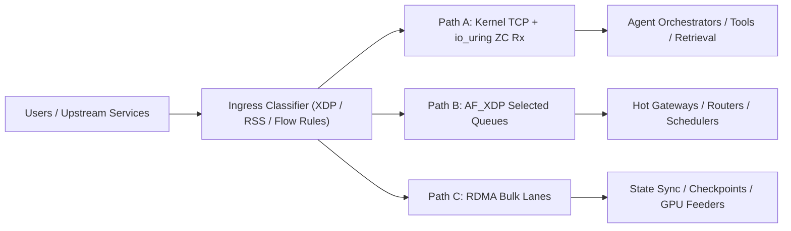

# Reference Architecture

This repo recommends a `tri-path` Linux networking architecture for agentic AI clusters, and extends that model toward a bounded `agentic NIC` control plane.

## Problem Statement

Agentic AI traffic does not look like a single long-lived inference stream. It is usually a mix of:

- small control-plane RPCs
- bursty retrieval requests
- metadata-heavy calls
- streaming responses
- periodic bulk state movement

One transport path rarely fits all of those shapes well. The architecture here separates them intentionally instead of forcing every flow into the same network stack.

## Design Goal

Keep the kernel where it helps, bypass it where it hurts, and reserve RDMA for the flows that can actually use it well.

The broader goal is stronger than transport selection alone:

- move selected decisions closer to the NIC
- keep those decisions bounded by deterministic safety rules
- expose an audit trail for why the dataplane changed
- preserve tenant fairness while allowing local optimization

## Path A: Kernel RPC

Use this for:

- planner and orchestrator RPC
- tool calls
- memory lookups
- metadata-heavy storage traffic
- general microservice communication

Recommended features:

- `RSS`, `XPS`, and explicit IRQ affinity
- `NAPI` and `busy_poll`
- `io_uring` zero-copy Rx where supported
- `SO_REUSEPORT` and per-core accept loops

Why:

- easier operations
- normal TCP behavior
- better compatibility with existing service frameworks
- lower engineering risk for the majority path

Watch for:

- softirq saturation
- queue imbalance
- TLS termination CPU cost
- cross-NUMA wakeups
- copy amplification between userland services

## Path B: AF_XDP Fast Path

Use this for:

- ultra-hot ingress services
- packet routers
- low-latency retrieval gateways
- queueing front doors
- internal service edges where packet shape is stable

Recommended features:

- `XDP` classifier for queue selection
- `AF_XDP` sockets on selected RX/TX queues
- zero-copy mode when the NIC driver supports it
- direct per-core worker ownership of queues

Why:

- lower per-packet CPU overhead
- reduced copy and syscall cost
- stronger control of queue-to-core placement

Watch for:

- UMEM sizing mistakes
- refill starvation
- hidden wakeup cost
- XDP redirect complexity
- operational friction versus normal sockets

## Path C: RDMA Bulk Path

Use this for:

- repeated shard-to-shard transport
- vector or index synchronization
- checkpoint and state movement
- storage or object movement on trusted east-west fabrics
- GPU-adjacent transfer pipelines

Recommended features:

- explicit memory registration strategy
- completion queue isolation
- flow control validation under loss
- RoCE tuning only on a well-managed fabric

Why:

- lower CPU cost for bulk movement
- low latency under stable flow patterns
- strong throughput once setup costs are amortized

Watch for:

- memory registration overhead
- congestion on RoCE fabrics
- peer exchange complexity
- poor fit for tiny RPCs
- operational burden if only a small fraction of flows benefit

## What Not To Do

- do not move all traffic to `AF_XDP`
- do not move every service to `RDMA`
- do not benchmark only with large streaming tests
- do not leave queue steering to default settings

## Platform View

## Agentic NIC Extension

On top of the three transport paths, the repo proposes a higher-level control model:

- `Intent Layer`: the host specifies goals such as prioritization, fairness, or protection targets
- `Agent Layer`: the NIC-local logic proposes bounded adjustments
- `Guardian Layer`: deterministic checks approve, rewrite, or reject actions
- `Audit Layer`: an append-only reasoning log records observed state, proposed actions, and applied changes

That model is described further in:

- [`./agentic-nic-architecture.md`](./agentic-nic-architecture.md)
- [`./safety-and-guardrails.md`](./safety-and-guardrails.md)
- [`./reasoning-log-design.md`](./reasoning-log-design.md)
- [`./multi-tenant-agent-quotas.md`](./multi-tenant-agent-quotas.md)

## Driver Recommendations

### Intel

- Ethernet path: `ice`
- RDMA path: `irdma`

Best fit when you want one Linux-first stack that spans:

- kernel TCP
- `AF_XDP`
- RDMA

### Broadcom

- Ethernet path: `bnxt_en`
- RDMA path: `bnxt_re`

Best fit when your environment is already aligned around Broadcom firmware, tooling, and RoCE validation.

## Decision Rule

Use this rough rule when classifying a flow:

- if the flow is latency-sensitive, request-response oriented, and benefits from normal service semantics, keep it on Path A
- if the flow is packet-hot, queue-stable, and CPU-expensive in the host stack, consider Path B
- if the flow is bulk, repeated, and east-west, consider Path C
